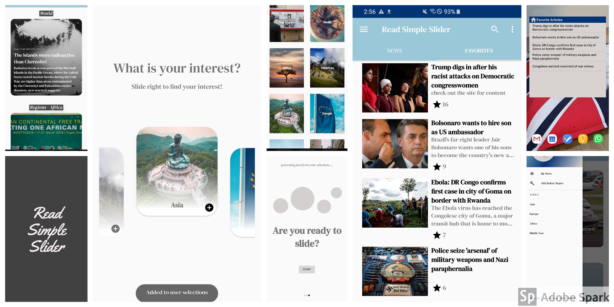
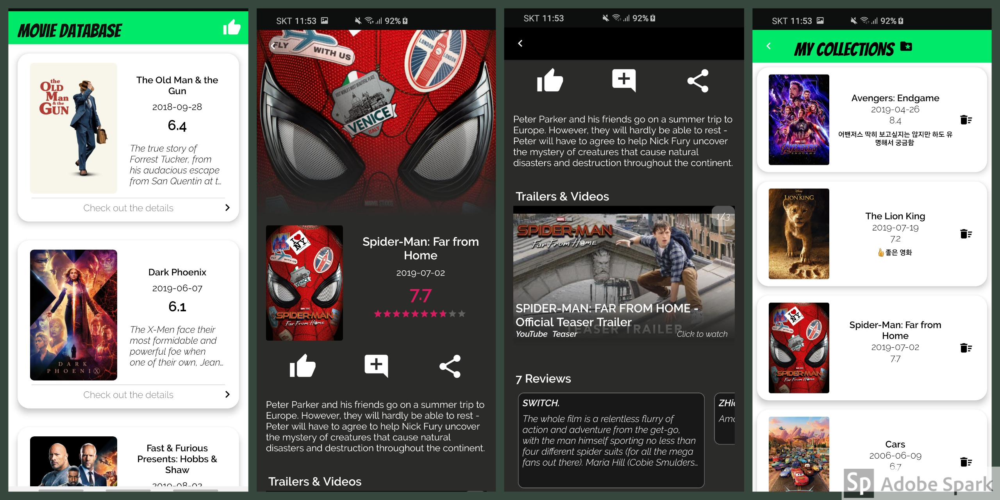

> _반갑습니다, 한가희입니다._
> _세상에 필요한 안드로이드 개발자가 되기 위해 노력하는 중 입니다._

 
My name is Gahee Han, studying at Hanyang University(2016~). I have been studying foreign languages since I was very young, starting when I lived in Canada from 2005 to 2007. I studied English and French during elementary school years. After enrolling Daewon foreign language high school in Korea, I majored in Japanese. Now I am in Hanyang university majoring in Chinese Language and Literature. Even though I have spent almost half of my life mainly studying languages, my dream has been scientist and engineer. To pursue my dream before it gets too late, I started learning programming since 2018 May. I am now at an intermediate level of this area, and my focus is now on jumping into the next high level.
  

### ☎ Contact
<table style="width:100%">
  <tr>
    <th>Gmail</th>
    <th>Github</th>
    <th>Linkedin</th>
  </tr>
  <tr>
    <td>
    
    </td>
    <td>
    
    </td>
    <td>
    
    </td>
  </tr>
</table>

### ✔ Education

  <table width="100%">
    <tr>
      <td>
      </td>
      <td></td>
    </tr>
  </table>

* Hanyang University Undergraduate (2016.02 - Present)
  * Chinese Literature and Language major
* Earned & Currently Earning credits of CS related subjects such as:
  * C++ Programming /  Unix System Programming /  DBMS / Discrete Mathematics / Programming for Engineers (Python) / Basic Web Programming /  Data Visualization
* Daewon Foreign Language High School (2011.03 - 2014.02)
  * Japanese Department Graduate

### ✔ Experience

* Mentor & Organizer of Hanyang University’s Android Study Group (2019.09 - Present)
  * Taught Java concepts and Android basics
  * Online Communication with mentees using Slack

* Udacity Android developer Nanodegree graduate (2019.01 - 2019.07)
  * Completed 6 projects on core concepts of Android Development

* Participant of Samsung Multicampus Android Mobile App Development Education (2018.08)
  * Completed capstone team project
  * Designed UI for busking information app

### ✔ Additional Skills
* Familiar with Programming in Windows & Linux(Ubuntu) OS
* Proficient Version Control Skills with Git

* Professional English Skill
  * OPIc : Level Intermediate High (2018.07)
  * TOEIC Speaking : Score 200/200 (2018.06)
  * TOEIC : Score 985/990 (2018.02)

* Intermediate Chinese Skill
  * HSK : Level 6, Score 249/300 (2018.01)

### 🏆 Past Projects

#### **Assignments / Projects**
* **Scrawling Twitter data with Python (2018.11)**
  * Data scrolling & visualization with tweepy, matplotlib,  pandas, konlpy, beautiful soup etc.

* **Simple quiz web app with HTML & javascript (2018.10)**

 
#### **Udacity Android Developer Nanodegree Projects**

{:class="img-responsive"}
> Capstone Project : Read Simple Slider App

* **Completed 5 Toy Projects on Fundamental concepts of Android & 1 Capstone Project (2019.01 - 2019.07)**
* [Link to my Udacity certificate](https://graduation.udacity.com/confirm/J54R3E7)
* Built Apps that include :
  * Network connection for fetching JSON & XML data  using Volley, Retrofit library, AsyncTaskLoader, etc.
  * Video display using SimpleExoPlayer
  * LiveData with MVVM architecture
  * Firebase AdMob, Analytics, Real Time Database
  * Paid & Free version configuration in Gradle
  * Google Cloud Endpoint
  * Material Design Specifications
  * Tablet version of the app
  * ListView Widget
  * Room database library
  * UI testing with espresso
  * etc.

#### **Others**
{:class="img-responsive"}
> Movie Database App made for teaching mentees.

* **Sample App Made for Teaching School Mentees : Movie Database App (2019.08)**
  * Simple Movie Poster App that displays movie information fetched from movie site API
  * Includes Room DB, LiveData, ViewModel
  * Has like button, comment & sharing function

   

> Naver D2 mini DevFest 출품작 : The Slider App

* **Naver D2 mini DevFest Competition : Live Slider App (2019.07)**
  * Simple RSS feed that displays news fetched with retrofit2
  * Live slider with Timer & ViewPager
  * Includes **python flask** server for analysing images with **Google Vision API** and integrated the results with the search bar.
