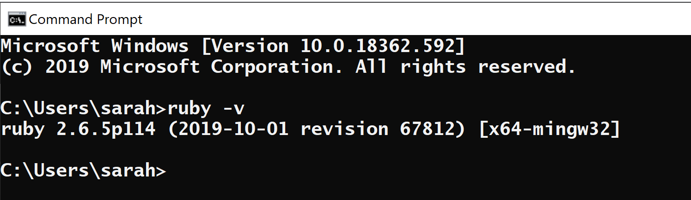

# [FORIF 세미나 자료] Jekyll 로 Github 블로그 만들기!

<br><br><br>

***Table of Contents***

1. **준비** (Prerequisites)
    - Ruby, RubyGems, GCC, Make 설치
    - *Atom 설치, Atom Terminal 플러그인 설치*
    - Bundler 설치
    - Bundler 프로젝트 만든 후 Jekyll 설치
2. **Github Page 에 Hosting 하기** (Deployment)
    - Repository 만들고 remote add, push!
    - Jekyll Admin 플러그인 추가하기
3. **기능 추가하기** (Customization)  ****
    - 테마 고르기
    - **Disqus** 댓글 기능 추가하기 (TBA)
    - **Google Analytics** 기능 추가하기 (TBA)
4. **추가 자료들** (Additional Resources)
    - [https://jekyllthemes.io/](https://jekyllthemes.io/)
    - [https://www.buymeacoffee.com/](https://www.buymeacoffee.com/)
    - [https://www.favicon.cc/](https://www.favicon.cc/)
    - [https://jekyllrb.com/jekyllconf/](https://jekyllrb.com/jekyllconf/)

---

***Start of Prerequisites***

### Jekyll (지킬 사이트)

[Jekyll : Simple, blog-aware, static sites](https://jekyllrb.com/)

### Atom 설치하기

→ Atom 내부에 Terminal 플러그인 설치하기 

→ Atom 말고 다른 에디터는?...

VS 를 써봤는데 너무 지저분하더라 ... 사실 VS Code 를 많이 안써서 낯설기도 하고, 웹사이트 용으로 사용하기엔 필요없는 기능들도 많고. 그래서 Atom 을 선택. 

### 설치되어 있는지 확인합시다

#### 1. Ruby 버전 2.4.0 이상 

`ruby -v` 으로 설치 여부 확인 



#### 2. RubyGems 

`gem -v` 으로 설치 여부 확인 


#### 3. GCC 와 Make 

`gcc -v` , `g++ - v` 그리고 `make -v` 으로 설치 여부 확인 

---

### Install Ruby on Windows

이 모든걸 한 번에 다운받기 

[RubyInstaller for Windows](https://rubyinstaller.org/)

**WITH DEVKIT** 밑의 파일로 다운로드 


설치 마지막 단계에

```
ridk install
```

커맨드 프롬프트 닫았다가 다시 열고 Jekyll Bundler 설치 

```
gem install jekyll bundler
```

제대로 설치되었는지 확인하기

```
jekyll -v
```

---

### Install Ruby on MacOS

[Jekyll on macOS](https://jekyllrb.com/docs/installation/macos/)

**맥 유저의 노트북에 다운로드 해볼 수 있나 ...** 

---

### Ruby, RubyGems, 컴파일러 다 따로 다운받으려면 ...

#### Ruby 다운받기 

* [Ruby](https://www.ruby-lang.org/en/)

#### RubyGems 다운받기 

* [Download RubyGems](https://rubygems.org/pages/download)

#### GCC 다운받기 

* [Installing GCC](https://gcc.gnu.org/install/)

#### GNU Make 다운받기 

* [Make - GNU Project - Free Software Foundation](https://www.gnu.org/software/make/)

---

### Jekyll, Gem, Gemfile, Bundler 개념

Jekyll 은 Ruby 라는 언어로 작성됨. 

Gem 은 Ruby 프로젝트에 넣을 수 있도록 코드들을 Packaging해서 라이브러리화 하는 코드.

Gem 을 이용해서 내가 만든 기능을 다른 사람들의 Ruby 프로젝트에 넣을 수 있음. 

→ Plugin 이라고 생각하면 됨. 

### Gem의 기능들

- Ruby 객체를 JSON 으로 변환
- Pagination
- Github 과 같은 API 와 소통

Jekyll 또한 하나의 Gem이다. 다른 많은 Jekyll 플러그인들도 또 하나의 Gem 일 뿐.

### Gemfile

Jekyll 블로그를 만들면 여러 디렉토리와 파일들이 자동으로 생성되는데, 그 중에 Gemfile 이라는 파일도 생성됨. 

Gemfile 안에서 여러 Gem들 (플러그인들)을 관리함. 

### Bundler

Bundler 는 Gemfile 안에서 Gem 들을 설치 할 수 있도록 도와주는 것. 

Bundler 또한 또 하나의 Gem 이다 ... 

#### 1. Bundler 설치

`gem install bundler` 

#### 2. Gemfile 안에 들어가있는 Gem 들을 Bundler 를 이용해 설치 

`bundle install` 

#### 3. Gem들 중 하나인 Jekyll 을 이용해 사이트를 빌드 

`bundle exec jekyll serve` 

→ Bundler 를 사용했을 경우 장점 : Gemfile 에 셋팅되어있는 Gem들의 버전을 사용하는 것이 보장됨. 만약 Gemfile 을 사용하지 않는다면 그냥 `jekyll serve` 만 해도 사이트가 빌드된다. 

---

### **설치한 Bundler 를 이용해서 프로젝트 만들기**

#### 1. 블로그를 위한 디렉토리를 만든다 

`mkdir my-jekyll-website` 

해당 디렉토리 안에 들어간다 

`cd my-jekyll-website` 

번들러 프로젝트를 만든다 

`bundle init`

#### 2. "./vendor/bundle" 디렉토리 및에다가 gem들을 설치할 수 있도록 설정한다. 

`bundle install --path vendor /bundle` 

#### 3. 만든 번들러 프로젝트에 Jekyll 을 디펜던시로 사용하도록 추가한다.

`bundle add jekyll`

 

#### 4. bundle add jekyll 커맨드를 수행한 후 jekyll 커맨드를 이용해 블로그를 위한 디렉토리와 파일들을 설치한다. 

```
bundle exec jekyll new --force --skip-bundle .
bundle install 
```

#### 5. localhost 에 사이트 Serve 하기

블로그를 위한 파일들이 모두 생성되었으므로 로컬 호스트에서 이를 확인한다. 

`bundle exec jekyll serve`

인터넷 브라우저에 아래 주소로 들어간다. 

```
http://127.0.0.1:4000
```

***End of "Prerequisites"***

---

***Start of "Deployment"***

### Github Page 로 Hosting 하기

지금까지 만든 파일들은 어떤 서버에 호스팅 되어있는 것이 아니라, 내 컴퓨터 (local host) 에서만 돌아갑니다. Github Page 서비스를 이용하면 local 에 있는 이 파일들을 깃헙 서버에 올릴 수 있고, `https://myaccount.github.io/myblog` 와 같은 도메인으로 누구나 접속할 수 있습니다.

#### 1. Github 에 레포 만들기 

위에서 만든 디렉토리들을 올릴 Repository 를 만든다. 


    📌레포 이름이 번들러 프로젝트의 이름과 같을 필요는 없음

#### 2. 번들러 프로젝트 폴더 안으로 들어와서 Git Bash 혹은 터미널을 열고 

```
git init

git checkout -b [브랜치 이름]
```

#### 3. ***_config.yaml*** 파일 안의  **baseurl :**  필드 수정하기 

```
baseurl : "/레포이름" 
```

#### 4. 폴더 안의 파일들을 Checkout 한 Branch 위에다가 add, commit 하기 

```
git add .
git commit -m "initial commit"
```

#### 5. Remote 레포를 origin 으로 설정하기 

`https://github.com/계정/레포이름.git` 주소를 복사하면 됨.


```
git remote add [레포 주소]
```

#### 6. `.gitignore` 파일 설정하기 

```
# Ignore metadata generated by Jekyll
_site/
.sass-cache/
.jekyll-cache/
.jekyll-metadata

# Ignore folders generated by Bundler
.bundle/
vendor/
```

#### 7. Repo 에다가 파일들 push 하기 

```
git push origin [브랜치 이름]
```

#### 8. 나의 깃헙 페이지 도메인으로 접속해 deploy 된 사이트 확인하기!

---

### 참고 사항

📌블로그를 수정할 때는 수정한 모든 파일들을 저장한 후 터미널에다가 

```
git add . 
git commit -m "커밋 메시지"
git push origin [브랜치 이름]
```

과 같이 Push 작업을 해 주면 됩니다. 

📌 push 를 날릴때마다 서버가 Deploy  되는데, push 와 동시에 deploy 되는게 아니라 **1분 정도 기다리셔야** 합니다. 

📌 ***blog repository → environment 탭 클릭 → View Deployment 버튼 클릭*** → 블로그가 남들에게 어떻게 보이는지 확인 가능


📌 에디터에서 편집하는 것이 불편하면 jekyll admin 플러그인을 설치하시면 됩니다. ~~경험상 Admin 을 잘 사용하지는 않습니다.~~ 


***End of "Deployment"***

---

***Start of "Customization"***

### Customizing

#### Theme 

* [Jekyll Themes](http://jekyllthemes.org/)
→ 여러 테마들을 고를 수 있음. 

#### Github Supported Themes 
* [Supported themes](https://pages.github.com/themes/)

*Supported Theme 사용 안하면 자꾸 메일이...* 


*⇒ `_config.yaml` 파일 안의 `theme : 테마이름` 줄을 지워버리면 경고 메일이 오지 않음.*