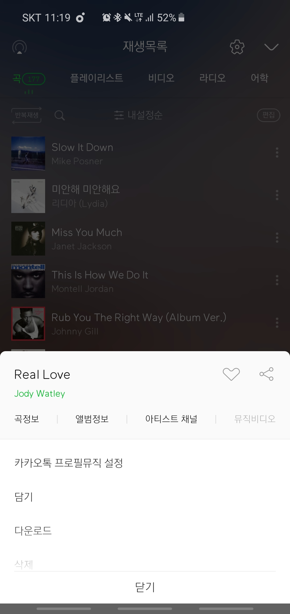
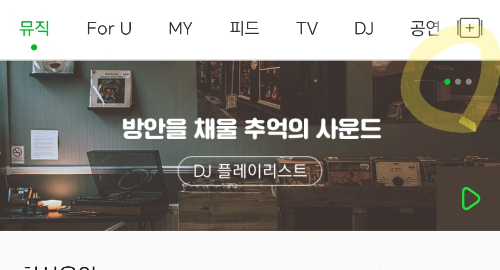

# 멜론 앱 UI 분석

### **Bottom Sheet Dialog**

Bottom Sheet Dialog는 곡 제목 가장 우측의 세로로 된 ... 모양의 버튼을 눌렀을때 뜬다. 유저는 카톡 프사로 음악을 설정할 지, 다운로드 할지 등등 여러 액션을 선택할 수 있다. 이 때 닫기 버튼 바로 위에 흰색 그래디언트가 보인다. 그래티언트는 유저에게 "리스트가 아직 끝나지 않았으며 더 다양한 액션의 종류가 있음"을 시사한다.

자연스럽게 스크롤을 이끌어낼 수 있다는 점에서 매우 정교한 디자인이다. 한 편 아쉬운 점은 가장 하단의 닫기 버튼의 색 마저 흰색이라는 점이다. **그래디언트를 따라 스크롤을 하다가 자칫하면 닫기를 누를 수 있다.** 리스트 안의 선택지들과는 분명히 다른 역할의 버튼이므로 어느정도 명확한 구분이 있었다면 더 훌륭했을 것 같다.

### **Melon Chart (ViewPager)**

멜론의 파격적인 변화 중 하나는 차트 Top 10 을 Top 5 로 줄인 것이었다. (어디까지나 개인적인 의견이다) 차트를 다양한 테마로 나누어 View Pager 위에다가 띄우고 그 뒤의 배경은 페이저의 슬라이드에 맞게 일렁이는 파도처럼 움직이며 색이 바뀐다.

~~이런 UI를 생각해낸 기획자, 디자이너 그리고 이것을 구현한 개발자 분들 모두 존경스럽다~~. 더 나아가 디테일하게 01 실시간차트, 02 재즈 핫트랙... 과 같은 상단 타이틀 부분의 숫자들의 색도 배경의 색에 맞춰서 바뀐다.

이 구현을 관찰하며 여러 의문점이 들었는데 그 중 하나는 이렇게 네트워크 작업이 많이 일어나는 음악 앱에서 애니메이션을 리치하게 넣게 된 이유가 뭘까 였다. 왜 하필 저기에, 저런 애니매이션을? 시각적인 것이 변화함에 따라 사람의 심리에도 변화가 있어 해당 섹션에 시선을 집중시키고 클릭을 유도하는 효과가 있는 것일까?

부가적으로 ViewPager 밑에 조그마하게 넣은 Slide Indicator 도 좋다고 생각한다. 디자인에 전혀 문외한인 나의 의견이라 약간 이상할수도 있지만 Slide Indicator의 색상도 타이틀 숫자가 변하는 것과 비슷하게 바뀌었다면 어땠을까... 생각해본다. 너무 난잡했으려나.

...라고 생각하던 찰나 아래의 유아이가 머릿속을 스쳐지나갔다. (노란 형광 동그라미 부분)

아무래도 ViewPager 랑 Dotted Slide Indicator를 구현하는 데에는 보일러 플레이트 코드가 많이 나오니까 템플릿화 해서 사용하지 않을까 싶다. 템플릿화 해서 사용하는 경우에는 원래의 구현을 일일이 화면마다 수정하는 것 보다 모두 통일해서 사용하는 것이 훨씬 편리하지 않을까?

### **Collapsible List**

검색 창에는 인기 검색어 리스트에 Top 10 노래를 띄워준다. 처음 화면을 열면 다섯개만 리스트에 보이고 전체보기를 누르면 리스트가 열 개로 늘어난다. 인기검색어 리스트 뿐만 아니라 많이 찾는 OST 리스트가 있는데 둘 다 똑같이 접혀있다가 필 수 있는 리스트로 구성되어 있다. 다만 전체보기로 피는 것 만 가능하고 다시 collapse할 수 있는 기능이 없다.

사람들이 드라마나 영화의 OST 는 노래의 제목보다 멜로디만 기억하는 경우가 많으므로 (작품 감상 도중 제목을 알 방법이 없으니) 이렇게 검색창에 많이 찾는 OST를 노출 해 놓으면 사람들이 "아 맞어 이 노래야!" 하고 빨리 찾을 수 있을 것이다. 꽤나 많은 생각이 들어간 배치이다.

### 아쉬운 점
멜론 앱 디자인에서 가장 아쉬운 부분은 1. 폰트가 너무 얇아서 시각이 좋지 않은 사람에게 불편할 거라는 점, 2. 너무 Flat 해서 멜론 이라는 몽글몽글한(?) 이미지와 다르게 UI요소들이 날카로워 보인다는 점, 3. 음악 뿐만 아니라 어학 오디오, 팟캐스트 등등 다양한 콘텐츠가 있는데 이들을 부각시키지 못한다는 점 등이 있다. 타인이 만든 앱에 대해서는 몇 시간이고 불평 불만을 늘어놓기는 쉽다. 혹시나 이 글을 읽게 되는 관계자 분이 있다면 이는 순전히 UI를 보는 나의 감각을 기르기 위한 `분석` 일 뿐이라는 점을 참고해 주셨으면 한다.

### 디자인 외
디자인 외적인 것으로 멜론을 사용하면서 알아차린 것은 메인 화면을 띄울 때 화면을 스크롤 해야만 보이는 부분들은 아직 로드를 하지 않다가 스크롤을 할 때에야 로딩을 한다는 점이다. 엄청나게 빨리 스크롤을 하지 않고 정상적인 속도로 하더라도 회색 placeholder박스들을 엄청나게 많이 볼 수 있다. 아무래도 API 요청을 한 화면에서 10개는 넘게 날릴테니... 그래서 Paging 도 하지 않고 '더 보기' 텍스트 버튼을 둔거겠지?
